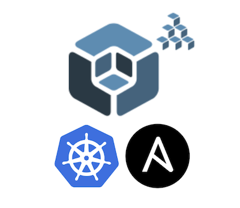

# Kubernetes cluster setup using Kubespray and cluster management with Rancher
<p align="center">
  
</p>

## 📑 Table of Contents

- [Introduction](#Introduction)
- [Overview](#verview)
- [Setting up Virtual Machines](#setting-up-virtual-machines)
- [Kubespray Installation](#kubespray-installation)
- [Setting up the Kubernetes Cluster](#setting-up-the-kubernetes-cluster)
- [Installing Rancher to Manage our Kubernetes Cluster](#installing-rancher-to-manage-our-kubernetes-cluster)

## Introduction

This guide demonstrates how to set up a production-grade Kubernetes cluster using Kubespray -— a versatile and powerful tool that simplifies the deployment of Kubernetes on various cloud environments, virtual machines, or bare-metal servers. By leveraging the capabilities of Kubespray. Kubespray simplifies the process of provisioning Kubernetes clusters with powerful automation, while Rancher provides an intuitive interface for managing clusters, workloads, users, and policies.
By combining these two tools, you'll gain a flexible, scalable, and manageable Kubernetes environment that is suitable for both learning and real-world applications.

## 🔍 Overview

Kubespray is an open-source tool that uses Ansible to automate the installation and configuration of Kubernetes clusters. It supports various infrastructure types including public cloud, private cloud, virtual machines, and bare metal.

### Key features of Kubespray:

* Highly configurable and production-ready

* Supports High Availability (HA) clusters

* Compatible with major Linux distributions

* Extensible via Ansible’s playbooks and inventory structure

### Rancher is a powerful Kubernetes management platform that provides:

* Centralized cluster management (on-prem, cloud, hybrid)

* User-friendly web UI and RBAC (Role-Based Access Control)

* Monitoring, logging, and app catalog (via Helm)

CI/CD, backup, and security policies

By deploying Rancher on top of your Kubernetes cluster, you get a full-featured control plane to easily manage workloads, nodes, namespaces, users, and more.

## 🖥️ Setting up Virtual Machines

For this tutorial, we will use 4 VirtualBox VMs running Ubuntu 22.04 LTS, all connected through a NAT network with port forwarding or optionally through a host-only network for easier SSH access.

## 💻 VM Architecture
| VM  | Role                   | Description                                      |
| --- | ---------------------- | ------------------------------------------------ |
| VM1 | Kubernetes Master Node | Runs control plane components                    |
| VM2 | Kubernetes Worker Node | Runs workloads and joins the cluster             |
| VM3 | Kubespray Host         | Runs Ansible to provision the Kubernetes cluster |
| VM4 | Rancher Server         | Hosts the Rancher UI to manage the cluster       |

All VMs should have:

Ubuntu 22.04 installed

SSH enabled

Minimum 2 CPUs, 2–4 GB RAM, and 20 GB disk space (per VM)

✅ Make sure all nodes can reach each other over the private network and that the Ansible control node (VM3) can SSH into the master and worker nodes.

## 🗺️ Network Topology Diagram


First of all, edit the hosts file on all of the nodes so that we don’t have to remember the IP addresses every time we configure something.

| VM Name        | Role            | IP Address (example) | Description                              |
| -------------- | --------------- | -------------------- | ---------------------------------------- |
| `vm-kubespray` | Kubespray Host  | 10.81.48.14          | From here you'll run Ansible & Kubespray |
| `vm-master`    | K8s Master Node | 10.81.48.5           | Control plane of Kubernetes cluster      |
| `vm-worker`    | K8s Worker Node | 10.81.48.2           | Will join the cluster as a worker node   |
| `vm-rancher`   | Rancher Server  | 10.81.48.15          | Rancher UI to manage the cluster         |

🧠 Tips

```
Consider updating /etc/hosts on vm-kubespray-Host for easier hostname use:

# /etc/hosts
10.81.48.5  vm-master
10.81.48.2  vm-worker
```

🛠️ SSH Configuration for Kubespray Setup

To use Kubespray for deploying your Kubernetes cluster, passwordless SSH access must be established from the Kubespray installation server to the Kubernetes master and worker nodes.

Run in the vm-kubespray-Host below commands as a root user

```
ssh-keygen
```
Copy the public key to k8s nodes :
```
ssh-copy-id root@vm-master
ssh-copy-id root@vm-worker
```

# 🚀 Kubespray Installation

At this point, we have two virtual machines prepared for the Kubernetes cluster:

🟩 1 Master Node

🟦 1 Worker Node

Next, we will install Kubespray on the designated installation server (vm-kubespray).

Once Kubespray is installed, we simply need to specify:

The number of master nodes

The number of worker nodes

...and Kubespray will take care of the rest — provisioning, configuring, and deploying the Kubernetes cluster using Ansible.

📥 Cloning the Kubespray Repository

To begin the Kubernetes deployment, we need to clone the Kubespray repository onto the vm-kubespray server.

You may choose to clone the latest version, or a specific stable release depending on your requirements.

✅ Clone the Repository
```
git clone https://github.com/kubernetes-sigs/kubespray.git
cd kubespray
```

⚙️ Preparing the Inventory File

After cloning the Kubespray repository, you need to set up the Ansible inventory file. This file lists your Kubernetes nodes and is used by Kubespray to know where to install the cluster components.

Kubespray provides a template inventory that you can copy and customise for your setup.
```
cd kubespray/
cp -rf inventory/sample inventory/mycluster
vi inventory/mycluster/inventory.ini
```
Now edit the file as below:
```
# ## Configure 'ip' variable to bind kubernetes services on a
# ## different ip than the default iface
# ## We should set etcd_member_name for etcd cluster.
# ## The node that is not a etcd member do not need to set the value, or can set the empty string value.
[all]
vm-master ansible_host=10.81.48.5  ip=10.81.48.5 etcd_member_name=etcd   ansible_user=root
vm-worker ansible_host=10.81.48.2  ip=10.81.48.2    ansible_user=root
# node3 ansible_host=95.54.0.14  # ip=10.3.0.3 etcd_member_name=etcd3
# node4 ansible_host=95.54.0.15  # ip=10.3.0.4 etcd_member_name=etcd4
# node5 ansible_host=95.54.0.16  # ip=10.3.0.5 etcd_member_name=etcd5
# node6 ansible_host=95.54.0.17  # ip=10.3.0.6 etcd_member_name=etcd6

# ## configure a bastion host if your nodes are not directly reachable
# [bastion]
# bastion ansible_host=x.x.x.x ansible_user=some_user

[kube_control_plane]
vm-master
# node3

[etcd]
vm-master
# node2
# node3

[kube_node]
vm-worker
# node3
# node4
# node5
# node6

[calico_rr]

[k8s_cluster:children]
kube_control_plane
kube_node
calico_rr
```

📋 Understanding the Inventory File Groups

The [all] group declares all nodes in the cluster, including their names, IP addresses, and other variables like ansible_host, ip, and etcd_member_name.

The [kube_control_plane] group specifies the master nodes where the Kubernetes control plane components will run.

The [kube_node] group lists the worker nodes that will run your application workloads.

The [etcd] group defines the nodes on which the etcd key-value store will run — typically, this is the same as the master nodes.

🐳 Installing Docker and Running the Kubespray Container

Before running Kubespray inside a container, you need to install Docker on your Kubespray server (vm-kubespray).

1️⃣ Install Docker

Run the following command to install Docker using the official convenience script:
```
curl -fsSL https://get.docker.com/ | sh
```
2️⃣ Run the Kubespray Container

Once Docker is installed, run the Kubespray container. Make sure the image version matches the Kubespray version you cloned earlier from GitHub.

command: [Kubespray Documentation](https://kubespray.io/#/)
```
docker run --rm -it --mount type=bind,source="$(pwd)"/inventory/sample,dst=/inventory \
  --mount type=bind,source="${HOME}"/.ssh/id_rsa,dst=/root/.ssh/id_rsa \
  quay.io/kubespray/kubespray:v2.28.0 bash
```
🧩 Breaking Down the Docker Run Command
* docker run: Starts a new Docker container.
* --rm: Automatically removes the container after you exit its terminal, keeping your system clean.
* -it: Runs the container interactively with a terminal, so you can interact with it.
* $(pwd):/kubespray: Mounts your current working directory (where your Kubespray files are) into the container at /kubespray.
* ~/.ssh:/root/.ssh: Mounts your SSH private keys from your host into the container to enable SSH connections to your Kubernetes nodes.
* -vvv — Debug mode: shows in-depth debug information, including SSH commands, variables, and more.

# 🚀 Setting up the Kubernetes Cluster

Once you are inside the Kubespray container’s terminal, run the following command to install and configure your Kubernetes cluster:

```
ansible-playbook -i /inventory/inventory.ini --private-key /root/.ssh/id_rsa cluster.yml -vvv
```
This command will run the Ansible playbook cluster.yml on the hosts specified in the hosts file inventory.ini
and the result will be like this:
```
Friday 19 September 2025  11:05:48 +0000 (0:00:00.079)       1:05:05.839 ******

PLAY RECAP *****************************************************************************************************************************
vm-master                   : ok=638  changed=118  unreachable=0    failed=0    skipped=997  rescued=0    ignored=6
vm-worker                      : ok=438  changed=63   unreachable=0    failed=0    skipped=625  rescued=0    ignored=1

Friday 19 September 2025  11:05:49 +0000 (0:00:00.129)       1:05:05.969 ******
===============================================================================
download : Check_pull_required |  Generate a list of information about the images on a node ----------------------------------- 994.04s
/kubespray/roles/download/tasks/check_pull_required.yml:4 -----------------------------------------------------------------------------
download : Check_pull_required |  Generate a list of information about the images on a node ----------------------------------- 585.65s
/kubespray/roles/download/tasks/check_pull_required.yml:4 -----------------------------------------------------------------------------
download : Check_pull_required |  Generate a list of information about the images on a node ----------------------------------- 246.65s
/kubespray/roles/download/tasks/check_pull_required.yml:4 -----------------------------------------------------------------------------
kubernetes/preinstall : Preinstall | Restart systemd-resolved ----------------------------------------------------------------- 245.83s
/kubespray/roles/kubernetes/preinstall/handlers/main.yml:125 --------------------------------------------------------------------------
download : Download_container | Download image if required -------------------------------------------------------------------- 245.38s
/kubespray/roles/download/tasks/download_container.yml:57 -----------------------------------------------------------------------------
download : Check_pull_required |  Generate a list of information about the images on a node ----------------------------------- 155.23s
/kubespray/roles/download/tasks/check_pull_required.yml:4 -----------------------------------------------------------------------------
download : Download_file | Download item --------------------------------------------------------------------------------------- 89.69s
/kubespray/roles/download/tasks/download_file.yml:59 ----------------------------------------------------------------------------------
download : Download_file | Download item --------------------------------------------------------------------------------------- 81.25s
/kubespray/roles/download/tasks/download_file.yml:59 ----------------------------------------------------------------------------------
download : Download_container | Download image if required --------------------------------------------------------------------- 81.14s
/kubespray/roles/download/tasks/download_container.yml:57 -----------------------------------------------------------------------------
download : Download_file | Download item --------------------------------------------------------------------------------------- 65.44s
/kubespray/roles/download/tasks/download_file.yml:59 ----------------------------------------------------------------------------------
download : Download_file | Download item --------------------------------------------------------------------------------------- 61.54s
/kubespray/roles/download/tasks/download_file.yml:59 ----------------------------------------------------------------------------------
download : Download_container | Download image if required --------------------------------------------------------------------- 61.52s
/kubespray/roles/download/tasks/download_container.yml:57 -----------------------------------------------------------------------------
download : Download_container | Download image if required --------------------------------------------------------------------- 59.61s
/kubespray/roles/download/tasks/download_container.yml:57 -----------------------------------------------------------------------------
download : Download_file | Download item --------------------------------------------------------------------------------------- 58.55s
/kubespray/roles/download/tasks/download_file.yml:59 ----------------------------------------------------------------------------------
container-engine/containerd : Download_file | Download item -------------------------------------------------------------------- 52.79s
/kubespray/roles/download/tasks/download_file.yml:59 ----------------------------------------------------------------------------------
download : Download_file | Download item --------------------------------------------------------------------------------------- 50.69s
/kubespray/roles/download/tasks/download_file.yml:59 ----------------------------------------------------------------------------------
kubernetes/control-plane : Kubeadm | Initialize first control plane node (1st try) --------------------------------------------- 39.29s
/kubespray/roles/kubernetes/control-plane/tasks/kubeadm-setup.yml:187 -----------------------------------------------------------------
download : Download_container | Download image if required --------------------------------------------------------------------- 39.02s
/kubespray/roles/download/tasks/download_container.yml:57 -----------------------------------------------------------------------------
download : Download_container | Download image if required --------------------------------------------------------------------- 35.22s
/kubespray/roles/download/tasks/download_container.yml:57 -----------------------------------------------------------------------------
network_plugin/calico : Wait for calico kubeconfig to be created --------------------------------------------------------------- 27.28s
/kubespray/roles/network_plugin/calico/tasks/install.yml:471 --------------------------------------------------------------------------
root@5448e4e4fd37:/kubespray#
```

✅ Verifying the Kubernetes Cluster
Once the playbook has finished running successfully, return to your master node to check if the Kubernetes cluster is up and running.
````
root@masterk8:~# k get nodes -o wide
NAME       STATUS   ROLES           AGE   VERSION   INTERNAL-IP   EXTERNAL-IP   OS-IMAGE             KERNEL-VERSION       CONTAINER-RUNTIME
vm-master   Ready    control-plane   18m   v1.32.5   10.81.48.5    <none>        Ubuntu 22.04.5 LTS   5.15.0-153-generic   containerd://2.0.5
vm-worker   Ready    <none>          17m   v1.32.5   10.81.48.2    <none>        Ubuntu 22.04.5 LTS   5.15.0-153-generic   containerd://2.0.5
````
